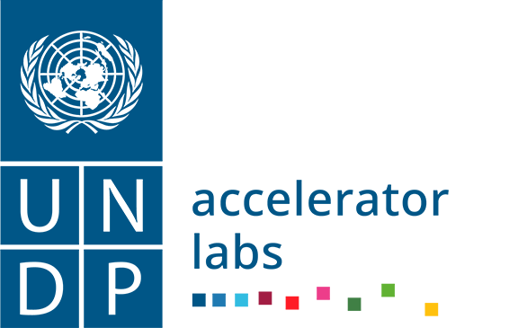

[Back to Home](../../README.md)

<!--  -->

## About

This factsheet allows you to share your work with an UNDP broad audience that is not familiar with the role of public innovation in supporting the national innovation ecosystem.

Each factsheet is meant to describe one tool, which can include one or more resources (see the glossary in the [introduction](https://undp.sharepoint.com/:w:/s/AcceleratorLabsNetwork/Ee4oFmEIgYBLtGR-qVt3LgwBTpxx7GkISAVuXE5YOhpYKg?e=LjfRy4)). We are not looking for a full description of ALL the work that you have done, but rather for ONE tool that can stand alone, please unbundle your work. For example, the whole of Thinkia, Ecuador's citizen innovation lab, is not a single tool, but many. We provide a factsheet for one of its component tool, its multistakeholder governance model. We believe such a model can be applied, with the necessary changes, to projects other than Thinkia, where the same problem of sharing the governance between the public sector and other stakeholders exists.

The factsheet should contain concise descriptions and be no longer than two pages.

Choose a title that uses simple words of common use rather than jargon. _A suggested format is the tool's function + a defining characteristic of the tool. For example: a_ _ **multistakeholder** _ _(defining characteristic)_ _ **governance model** _ _(function)._

## Proposed structure for factsheets

The factsheet for a tool should contain the following information.

**What it does.** List the three actions/activities that your tool allows to do (offer). _Suggestion: This [title of the tool] allows you to do [action 1], [action 2], and [action 3]._

**Value proposition for the government/other partner.** Describe the advantage using your tool will bring about. _Suggestion: By having a [title of the tool], you will enable [the partner] to achieve [something of value and align with UNDP's_ [_signature solutions_](https://www.undp.org/sites/g/files/zskgke326/files/migration/gh/ec896cafde73c2a1c1c2f66c3c3b9312b3ef19593e8ad50ccd0cb8ae621c7303.pdf) _and the_ [_SDGs_](https://sdgs.un.org/goals)_]_.

**Why and when to use it**. Give detail about the "right" environment for this tool to be effectively used. _Suggestion: This tool is most useful when [situation 1], [situation 2], and [situation 3]_.

**Known issues and troubleshooting**. Explain which are the necessaries requirements for this tool to be used so that the user know when not to use it. _Suggestion: If there is a lack of [requirement 1], [requirement 2], and [requirement 3], it is not yet the best moment to make use of this tool._

**Context**. Describe how this tool came into existence. If it is part of a bigger effort, describe that too.

**Cost**. _How much does it cost, in USD, to implement this tool? Suggestion: think about what the partner would spend to implement, not about how much it cost to create it in the first place._

 The training program cost around $30k, and that included a team of 2-3 instructors who developed the program in 2 months consisting of 8 modules, along with some international mentors who accompanied the teams on a weekly basis. Then, 2 pilots were funded, each with $15k, for 2 teams (out of the 10 participants). Throughout the program, we hired an R&D methodology specialist for $10k and an articulator to facilitate the emergence of a network of public innovators for another $10k.

**People**. _Describe the team needed to implement. Try to avoid just sharing the hierarchy rank and rather focus on their roles. Suggestion: number of members of the team and responsibilities._

At least 2-3 hours per week from 2 of the Lab heads, plus a similar amount of hours from our associate researcher for program monitoring, which could also be monetized. And finally, there is the ENI team, consisting of 2 individuals plus 1 focal point at Conacyt.

**Focal point**. Cristhian Parra, Head of Experimentation UNDP Paraguay Accelerator Lab

**Country, year, and language**. Paraguay 2022, Spanish

**Resources**. \

[Program Brochure ](https://drive.google.com/drive/u/1/folders/1tYMYZzm5dSIvAXPwZ1E5mZngW-xrFGRk)

[Program Syllabus](https://drive.google.com/drive/u/1/folders/1tYMYZzm5dSIvAXPwZ1E5mZngW-xrFGRk)

 [Content, Slides and Recordings of 15 workshops from the Public Innovators Program](https://drive.google.com/drive/u/1/folders/1DkX2xO2XDX2U5kWHN-zkU2iufa2cDCvm)